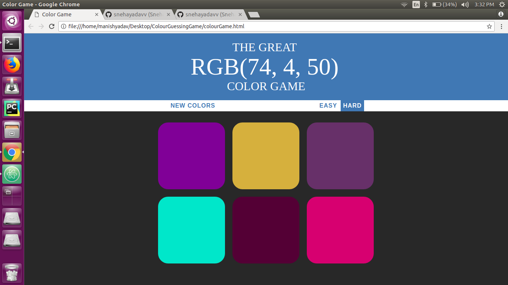

# ColourGuessingGame
A game of guessing colours using javascript

To install this game in your pc 

1. Open the folder where you want to install this game in your command line using `cd foldername` command.

2. Write `git clone https://github.com/snehayadavv/ColourGuessingGame.git` in command line.

3. Open colourGame.html file using any browser.

4. For given RGB value, the player guesses the colour. If the match is correct the colour of all blocks becomes same as the colour of the correct RGB value and game continues. If the player matches incorrectly, all blocks become same as the colour of the background.

Enjoy the game :)
